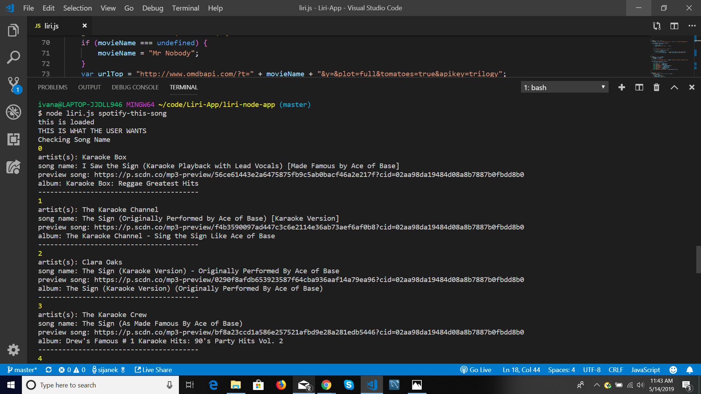

# liri-node-app 
# LIRI Bot
*Homework wk 10*

## Overview

Liri-node-app is an application that allows user to input certain command. LIRI is like iPhone's SIRI. However, while SIRI is a Speech Interpretation and Recognition Interface, LIRI is a Language Interpretation and Recognition Interface. LIRI will be a command line node app that takes in parameters and gives back relevant data.

### This app is able to return data to following commands:

* concert-this
* spotify-this-song
* movie-this
* do-what-it-says

### This command should give back the following data:

node liri.js concert-this <artist/band name here>

* Name of the venue
* Venue location
* Date of the Event (use moment to format this as "MM/DD/YYYY")

### This command should give back the following data:

node liri.js spotify-this-song <song name here>
  
* Artist(s)
* The song's name
* A preview link of the song from Spotify
* The album that the song is from
 

### if no song chosen then the app will default to 
  
  * "The Sign" by Ace of Base
  
  

### This command should give back the following data:

node liri.js movie-this <movie name here>
  
  * Title of the movie.
  * Year the movie came out.
  * IMDB Rating of the movie.
  * Rotten Tomatoes Rating of the movie.
  * Country where the movie was produced.
  * Language of the movie.
  * Plot of the movie.
  * Actors in the movie.
  
  

### This command will take the text inside of random.txt and then run following data:

node liri.js do-what-it-says

### and then run following data:

spotify-this-song for "I Want it That Way," 

### Technologies

Node.js
Axios npm
Request nmp
DotEnv npm
Moment npm
JavavScript
Node-Spotify API
Bands in Town API
OMDB API
npm installer

